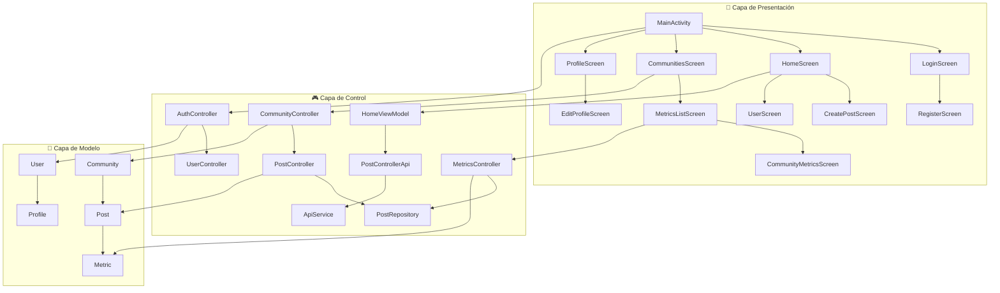
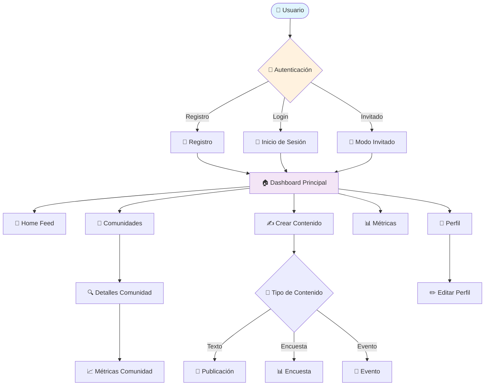

# Proyecto 5 - Plataforma de Comunidades Educativas

<div align="center">


### 🎓 Transformando la Educación a través de Comunidades Colaborativas

[](https://github.com/usuario/proyecto-5)
[](https://developer.android.com/about/versions/nougat)
[](LICENSE)
[]()

</div>

---

## 📋 Resumen Ejecutivo

**Proyecto 5** es una aplicación móvil Android de última generación que revoluciona el modelo educativo tradicional mediante la creación de una plataforma de comunidades colaborativas. La aplicación facilita el intercambio horizontal de conocimientos, promoviendo un entorno educativo inclusivo, motivador y centrado en el usuario mediante tecnologías modernas y arquitectura escalable.

### Visión
Transformar la educación de un modelo jerárquico y aislado a uno colectivo, significativo y accesible para todos los usuarios, especialmente jóvenes y estudiantes, mediante tecnología móvil de vanguardia.

### Misión
Crear un ecosistema digital robusto que reduzca el aislamiento educativo, fortalezca el sentido de pertenencia comunitaria y fomente la motivación intrínseca para el aprendizaje continuo, utilizando las mejores prácticas de desarrollo Android moderno.

---

## 📊 Información del Proyecto

<div align="center">

| 📋 Campo | 📝 Detalle |
|:---:|:---|
| **🏷️ Nombre** | Proyecto 5 |
| **📱 Plataforma** | Android (API 24+) |
| **🔧 Lenguaje** | Kotlin 1.9.20 |
| **🏗️ Arquitectura** | MVC Pattern + ViewModel |
| **🎨 UI Framework** | Jetpack Compose |
| **🌐 Networking** | Retrofit 2.9.0 + Gson |
| **📦 Versión** | 1.0 |
| **📦 Version Code** | 1 |

### 📈 Estadísticas del Proyecto

| Métrica | Valor |
|:---:|:---:|
| **📁 Archivos Kotlin** | 33 |
| **🎯 Pantallas (Composables)** | 12 |
| **🎮 Controladores** | 9 |
| **💾 Modelos de Datos** | 5 |
| **🧩 Componentes UI** | 2 |
| **📱 SDK Mínimo** | API 24 (Android 7.0) |
| **🎯 SDK Objetivo** | API 34 (Android 14) |
| **🔧 Compile SDK** | API 34 |

</div>

---

## 👥 Equipo de Desarrollo

| Rol | Nombre | Contribución |
|-----|--------|--------------|
| **Desarrollador Principal** | Vicente A. Elias Riveros | Arquitectura, UI/UX, Lógica de Negocio |
| **Desarrollador Principal** | Jean P. Valenzuela Navarrete | Frontend, UI/UX, Backend, Integración API |

---

## 🏗️ Arquitectura del Sistema

<div align="center">



</div>

### Estructura Modular del Proyecto

```
com.example.evaluacion2/
├── 📁 model/                          # Capa de Modelo de Datos
│   ├── User.kt                        # Entidad Usuario
│   ├── Community.kt                   # Entidad Comunidad
│   ├── Post.kt                        # Entidad Publicación
│   ├── Metric.kt                       # Métricas de Análisis
│   └── Profile.kt                      # Perfil de Usuario
│
├── 📁 controller/                     # Capa de Lógica de Negocio
│   ├── AuthController.kt               # Gestión de Autenticación
│   ├── UserController.kt               # Gestión de Usuarios
│   ├── CommunityController.kt          # Gestión de Comunidades
│   ├── PostController.kt               # Gestión de Publicaciones (Mock)
│   ├── PostControllerApi.kt            # Gestión de Publicaciones (API)
│   ├── PostRepository.kt               # Repositorio de Datos
│   ├── MetricsController.kt            # Análisis y Métricas
│   ├── HomeViewModel.kt                # ViewModel para Estado Reactivo
│   └── ApiService.kt                   # Interfaz de Servicios API
│
├── 📁 view/                           # Capa de Presentación
│   ├── MainActivity.kt                 # Actividad Principal
│   ├── LoginScreen.kt                  # Pantalla de Autenticación
│   ├── RegisterScreen.kt               # Pantalla de Registro
│   ├── HomeScreen.kt                   # Feed Principal
│   ├── CommunitiesScreen.kt            # Descubrimiento de Comunidades
│   ├── CreatePostScreen.kt             # Creación de Contenido
│   ├── MetricsListScreen.kt            # Panel de Métricas
│   ├── CommunityMetricsScreen.kt       # Análisis Detallados
│   ├── ProfileScreen.kt                # Perfil de Usuario
│   ├── EditProfileScreen.kt            # Edición de Perfil
│   ├── UserScreen.kt                   # Pantalla de Usuario
│   └── 📁 components/                  # Componentes Reutilizables
│       ├── BottomNavBar.kt             # Barra de Navegación Inferior
│       └── PostCard.kt                 # Tarjeta de Publicación
│
├── 📁 navigation/                     # Sistema de Navegación
│   └── NavGraph.kt                     # Configuración de Navegación
│
└── 📁 ui/theme/                       # Sistema de Diseño
    ├── Color.kt                        # Paleta de Colores
    ├── Theme.kt                        # Configuración de Tema
    └── Type.kt                         # Tipografía
```

### Patrón Arquitectónico MVC + ViewModel

- **Modelo (Model)**: Entidades de datos inmutables (`data class`) que representan la estructura de información
- **Vista (View)**: Componentes de UI declarativos con Jetpack Compose
- **Controlador (Controller)**: Gestión de lógica de negocio y coordinación entre capas
- **ViewModel**: Gestión de estado reactivo mediante `StateFlow` y `MutableStateFlow`
- **Repository Pattern**: Abstracción de fuentes de datos (Mock y API)

---

## ✨ Funcionalidades Principales

<div align="center">

| 🔐 Autenticación | 🏠 Feed Dinámico | 👥 Comunidades | 📊 Métricas | 👤 Perfiles |
|:---:|:---:|:---:|:---:|:---:|
| **Multi-modal** | **Multimedia** | **Categorizadas** | **Tiempo Real** | **Integrales** |
| Login/Registro/Invitado | Texto/Imagen/Video | Destacadas/Cerca/Nuevas | 7/30/90 días | Personalización |

</div>

### 🔐 Sistema de Autenticación y Gestión de Usuarios

#### Características de Seguridad
- **Autenticación Multi-modal**: Sistema de login con email/contraseña y modo invitado
- **Validación de Datos**: Verificación de credenciales en tiempo real
- **Gestión de Sesiones**: Estado persistente mediante `AuthController` singleton
- **Modo Invitado**: Acceso limitado para usuarios no registrados
- **Prevención de Duplicados**: Validación de correos y usuarios únicos

#### Implementación Técnica
```kotlin
// Gestión de sesión mediante singleton pattern
object AuthController {
    private var currentUser: User? = null
    private var isGuestMode: Boolean = false
    
    fun login(correo: String, contrasena: String, usuarios: List<User>): Boolean
    fun register(user: User): Boolean
    fun loginAsGuest()
    fun logout()
    fun getCurrentUser(): User?
}
```

#### Flujo de Usuario
```
Registro → Validación → Creación de Perfil → Acceso Completo
    ↓
Inicio de Sesión → Autenticación → Dashboard Principal
    ↓
Modo Invitado → Acceso Limitado → Funcionalidades Básicas
```

### 🏠 Feed de Contenido Dinámico

#### Capacidades de Contenido
- **Publicaciones Multimodales**: Soporte para texto, imágenes y videos
- **Sistema de Encuestas**: Creación y participación en encuestas interactivas con estadísticas en tiempo real
- **Gestión de Eventos**: Anuncios y organización de eventos comunitarios
- **Interacciones Sociales**: Sistema de comentarios y seguimiento de participación

#### Tipos de Contenido Soportados
- **Publicaciones Estándar**: Contenido textual con soporte multimedia
- **Encuestas**: Preguntas con múltiples opciones y porcentajes dinámicos
- **Eventos**: Anuncios de actividades con detalles y fechas

#### Integración con Backend
- **API REST**: Integración con Retrofit para comunicación con servidor
- **Estado Reactivo**: Uso de `StateFlow` para actualizaciones en tiempo real
- **Manejo de Errores**: Gestión robusta de errores de red y estados de carga

```kotlin
// ViewModel con estado reactivo
class HomeViewModel : ViewModel() {
    private val _posts = MutableStateFlow<List<Post>>(emptyList())
    val posts: StateFlow<List<Post>> = _posts
    
    private val _isLoading = MutableStateFlow(false)
    val isLoading: StateFlow<Boolean> = _isLoading
}
```

### 👥 Gestión Avanzada de Comunidades

#### Categorización Inteligente
- **Comunidades Destacadas**: Contenido curado y verificado
- **Comunidades por Ubicación**: Descubrimiento basado en proximidad geográfica
- **Comunidades del Usuario**: Gestión de membresías activas
- **Nuevas Comunidades**: Descubrimiento de comunidades emergentes

#### Estados de Comunidad
- **Abierta**: Acceso libre para todos los usuarios
- **Autogestionada**: Requiere aprobación de moderadores
- **Solicitar Acceso**: Proceso de solicitud controlado

#### Sistema de Roles
- **Moderador**: Gestión de contenido y miembros
- **Miembro**: Participación estándar en la comunidad
- **Coordinador**: Liderazgo y organización de actividades

### 📊 Sistema de Análisis y Métricas

#### Métricas de Comunidad
- **Miembros Activos**: Seguimiento de participación en tiempo real
- **Adquisición de Nuevos Miembros**: Análisis de crecimiento orgánico
- **Tasas de Participación**: Métricas de engagement y retención
- **Actividad de Encuestas**: Análisis de interacciones y respuestas

#### Reportes Temporales
- **Análisis de 7 días**: Tendencias semanales
- **Análisis de 30 días**: Métricas mensuales
- **Análisis de 90 días**: Tendencias trimestrales

#### Visualización de Datos
- **Gráficos Interactivos**: Representación visual de métricas
- **Paneles de Control**: Dashboards personalizables
- **Top Comunidades**: Ranking de comunidades más activas
- **Sistema de Objetivos**: Seguimiento de metas y KPIs

### 👤 Gestión Integral de Perfiles

#### Características del Perfil
- **Información Personal**: Datos del usuario y preferencias
- **Estadísticas de Actividad**: Seguimiento de participación
- **Sistema de Logros**: Puntuación y reconocimientos
- **Historial de Interacciones**: Registro de actividades recientes
- **Comunidades del Usuario**: Lista de membresías activas

---

## 🔧 Especificaciones Técnicas

### Stack Tecnológico

| Componente | Tecnología | Versión |
|------------|------------|---------|
| **Lenguaje** | Kotlin | 1.9.20 |
| **Android Gradle Plugin** | AGP | 8.1.4 |
| **Framework UI** | Jetpack Compose | 2023.10.01 (BOM) |
| **Sistema de Diseño** | Material Design 3 | Latest |
| **Navegación** | Navigation Compose | 2.7.5 |
| **Carga de Imágenes** | Coil | 2.5.0 |
| **Networking** | Retrofit | 2.9.0 |
| **JSON Serialization** | Gson | 2.9.0 |
| **Corrutinas** | Kotlin Coroutines | 1.7.3 |
| **ViewModel** | Lifecycle ViewModel | 2.6.2 |
| **Arquitectura** | MVC + ViewModel | - |
| **SDK Mínimo** | Android API 24 | Android 7.0 |
| **SDK Objetivo** | Android API 34 | Android 14 |
| **Compile SDK** | Android API 34 | Android 14 |

### Dependencias Principales

```kotlin
// Core Android
implementation("androidx.core:core-ktx:1.12.0")
implementation("androidx.lifecycle:lifecycle-runtime-ktx:2.6.2")
implementation("androidx.activity:activity-compose:1.8.1")

// Jetpack Compose BOM
implementation(platform("androidx.compose:compose-bom:2023.10.01"))
implementation("androidx.compose.ui:ui")
implementation("androidx.compose.ui:ui-graphics")
implementation("androidx.compose.ui:ui-tooling-preview")
implementation("androidx.compose.material3:material3")

// Navigation
implementation("androidx.navigation:navigation-compose:2.7.5")

// Image Loading
implementation("io.coil-kt:coil-compose:2.5.0")

// Extended Icons
implementation("androidx.compose.material:material-icons-extended:1.5.4")

// ViewModel
implementation("androidx.lifecycle:lifecycle-viewmodel-compose:2.6.2")

// Networking
implementation("com.squareup.retrofit2:retrofit:2.9.0")
implementation("com.squareup.retrofit2:converter-gson:2.9.0")

// Coroutines
implementation("org.jetbrains.kotlinx:kotlinx-coroutines-android:1.7.3")

// Testing
testImplementation("junit:junit:4.13.2")
androidTestImplementation("androidx.test.ext:junit:1.1.5")
androidTestImplementation("androidx.test.espresso:espresso-core:3.5.1")
androidTestImplementation(platform("androidx.compose:compose-bom:2023.10.01"))
androidTestImplementation("androidx.compose.ui:ui-test-junit4")
```

### Configuración del Proyecto

#### Gradle Configuration
- **Android Gradle Plugin**: 8.1.4
- **Kotlin Compiler Extension**: 1.5.4
- **Java Compatibility**: 1.8
- **Build Types**: Debug y Release
- **ProGuard**: Configurado para builds de producción (actualmente deshabilitado)

#### Permisos de Android
```xml
<uses-permission android:name="android.permission.INTERNET" />
<uses-permission android:name="android.permission.ACCESS_NETWORK_STATE" />
```

#### Configuración de Red
- **Cleartext Traffic**: Habilitado para desarrollo (requiere configuración de seguridad en producción)
- **FileProvider**: Configurado para compartir archivos de forma segura

---

## 🎨 Experiencia de Usuario (UX/UI)

### Principios de Diseño

#### Material Design 3
- **Consistencia Visual**: Implementación completa de las directrices de Material Design 3
- **Accesibilidad**: Cumplimiento de estándares de accesibilidad WCAG
- **Responsive Design**: Adaptación automática a diferentes tamaños de pantalla
- **Dynamic Color**: Soporte para temas dinámicos del sistema (Android 12+)
- **Dark/Light Theme**: Soporte automático para temas claro y oscuro

#### Sistema de Colores
```kotlin
// Paleta Principal (Light Theme)
val Purple40 = Color(0xFF6650a4)      // Color primario
val PurpleGrey40 = Color(0xFF625b71)   // Color secundario
val Pink40 = Color(0xFF7D5260)          // Color terciario

// Paleta Oscura (Dark Theme)
val Purple80 = Color(0xFFD0BCFF)       // Primario oscuro
val PurpleGrey80 = Color(0xFFCCC2DC)   // Secundario oscuro
val Pink80 = Color(0xFFEFB8C8)         // Terciario oscuro
```

### Flujo de Navegación

<div align="center">



</div>

#### Componentes de Navegación
- **Bottom Navigation Bar**: Navegación principal entre secciones principales
- **Navigation Graph**: Gestión centralizada de rutas mediante `NavGraph.kt`
- **Type-Safe Navigation**: Uso de `sealed class Screen` para rutas tipadas
- **Back Stack Management**: Gestión inteligente del historial de navegación

#### Pantallas Implementadas
1. **LoginScreen**: Autenticación de usuarios
2. **RegisterScreen**: Registro de nuevos usuarios
3. **HomeScreen**: Feed principal de publicaciones
4. **CommunitiesScreen**: Descubrimiento de comunidades
5. **CreatePostScreen**: Creación de contenido
6. **MetricsListScreen**: Lista de métricas disponibles
7. **CommunityMetricsScreen**: Métricas detalladas por comunidad
8. **ProfileScreen**: Perfil del usuario
9. **EditProfileScreen**: Edición de perfil
10. **UserScreen**: Visualización de usuario

---

## 💾 Gestión de Datos

### Arquitectura Híbrida de Datos

La aplicación implementa una arquitectura híbrida que combina datos simulados (mock) para desarrollo y pruebas, con integración de API REST para producción.

#### Implementación Mock (Desarrollo)
- **Almacenamiento en Memoria**: Todos los datos se mantienen durante la sesión
- **Datos Predefinidos**: Conjuntos de datos de muestra para testing
- **Controladores Mock**: Implementación de lógica de negocio sin persistencia
- **Uso**: Desarrollo local, testing y demostraciones

#### Integración con API (Producción)
- **Retrofit**: Cliente HTTP type-safe para comunicación con backend
- **Gson**: Serialización/deserialización JSON
- **Corrutinas**: Operaciones asíncronas no bloqueantes
- **Estado Reactivo**: `StateFlow` para actualizaciones en tiempo real

#### Estructura de Servicios API

```kotlin
interface ApiService {
    @GET("/api/posts")
    suspend fun obtenerPosts(): Response<List<Post>>
    
    @POST("/api/posts")
    suspend fun crearPost(@Body post: Post): Response<Post>
}
```

#### Configuración de Retrofit

```kotlin
private const val BASE_URL = "http://10.0.2.2:3000/" // Emulador
// Producción: "https://tu-api.vercel.app/"

private val retrofit = Retrofit.Builder()
    .baseUrl(BASE_URL)
    .addConverterFactory(GsonConverterFactory.create())
    .build()
```

### Estrategia de Migración a Producción

#### Fase 1: Integración Backend ✅ (En Progreso)
- ✅ **API Integration**: Implementación de cliente HTTP con Retrofit
- ✅ **Error Handling**: Manejo robusto de errores de red
- ✅ **Loading States**: Estados de carga y feedback visual mediante `StateFlow`
- ⏳ **Authentication**: Sistema de tokens JWT (Pendiente)

#### Fase 2: Persistencia Local (Planificado)
- ⏳ **Room Database**: Base de datos local para funcionalidad offline
- ⏳ **Data Synchronization**: Sincronización bidireccional
- ⏳ **Cache Management**: Estrategia de caché inteligente
- ⏳ **Conflict Resolution**: Resolución de conflictos de datos

#### Fase 3: Optimización (Futuro)
- ⏳ **Performance Monitoring**: Métricas de rendimiento
- ⏳ **Memory Management**: Optimización de uso de memoria
- ⏳ **Network Optimization**: Compresión y optimización de datos
- ⏳ **Analytics Integration**: Tracking de uso y comportamiento

---

## 📐 Estándares de Desarrollo

### Convenciones de Código

#### Kotlin Style Guide
- **Naming Conventions**: 
  - `camelCase` para variables y funciones
  - `PascalCase` para clases y objetos
  - `UPPER_SNAKE_CASE` para constantes
- **Package Structure**: Organización por funcionalidad y capa
- **Documentation**: KDoc para funciones públicas y clases
- **Code Formatting**: Kotlin formatting rules estándar

#### Jetpack Compose Best Practices
- **State Management**: Uso apropiado de `State`, `StateFlow` y `ViewModel`
- **Recomposition Optimization**: Minimización de recomposiciones innecesarias
- **Component Composition**: Creación de componentes reutilizables y modulares
- **Theme Integration**: Uso consistente del sistema de temas Material 3
- **Performance**: Uso de `remember` y `derivedStateOf` para optimización

#### Arquitectura Patterns
- **Singleton Pattern**: Para controladores de estado global (`AuthController`, `UserController`)
- **Repository Pattern**: Abstracción de fuentes de datos (`PostRepository`)
- **ViewModel Pattern**: Gestión de estado de UI con ciclo de vida
- **Observer Pattern**: `StateFlow` para comunicación reactiva

### Estrategia de Testing

#### Testing Pyramid
```
    ┌─────────────────┐
    │   E2E Tests     │ ← Pruebas de extremo a extremo
    ├─────────────────┤
    │ Integration Tests│ ← Pruebas de integración
    ├─────────────────┤
    │   Unit Tests     │ ← Pruebas unitarias
    └─────────────────┘
```

#### Tipos de Pruebas
- **Unit Tests**: Validación de lógica de negocio en controladores
- **UI Tests**: Pruebas de componentes Compose con `ComposeTestRule`
- **Integration Tests**: Validación de flujos completos de usuario
- **Performance Tests**: Pruebas de rendimiento y memoria

#### Herramientas de Testing
```kotlin
// Dependencias de Testing
testImplementation("junit:junit:4.13.2")
androidTestImplementation("androidx.test.ext:junit:1.1.5")
androidTestImplementation("androidx.test.espresso:espresso-core:3.5.1")
androidTestImplementation(platform("androidx.compose:compose-bom:2023.10.01"))
androidTestImplementation("androidx.compose.ui:ui-test-junit4")
debugImplementation("androidx.compose.ui:ui-tooling")
debugImplementation("androidx.compose.ui:ui-test-manifest")
```

---

## 🚀 Proceso de Despliegue

### Configuración de Build

#### Build Variants
- **Debug**: Desarrollo y testing
  - Minificación deshabilitada
  - Logging habilitado
  - Signing con debug keystore
  - Cleartext traffic habilitado
- **Release**: Producción
  - Minificación habilitada (configurado, actualmente deshabilitado)
  - ProGuard/R8 optimización
  - Signing con release keystore
  - Cleartext traffic deshabilitado

#### Versionado
- **Version Code**: 1 (incremental para cada release)
- **Version Name**: "1.0" (semantic versioning)
- **Target SDK**: 34 (Android 14)
- **Min SDK**: 24 (Android 7.0)
- **Compile SDK**: 34 (Android 14)

### Distribución

#### Canales de Distribución
1. **Internal Testing**: Distribución interna para testing
2. **Closed Testing**: Beta testing con usuarios seleccionados
3. **Open Testing**: Beta pública
4. **Production**: Release público en Google Play Store

#### Requisitos de Distribución
- **Google Play Console**: Configuración de cuenta de desarrollador
- **App Signing**: Certificado de firma de aplicación
- **Store Listing**: Descripción, capturas de pantalla, iconos
- **Content Rating**: Clasificación de contenido apropiada
- **Privacy Policy**: Política de privacidad requerida

---

## 🗺️ Roadmap y Futuras Mejoras

### Versión 1.1 (Próxima Release)
- [ ] Completar integración con backend real
- [ ] Implementar autenticación JWT
- [ ] Sistema de notificaciones push
- [ ] Funcionalidad offline mejorada con Room
- [ ] Análisis de uso y métricas avanzadas
- [ ] Mejoras en manejo de errores de red

### Versión 1.2 (Futuro)
- [ ] Chat en tiempo real
- [ ] Sistema de badges y gamificación
- [ ] Integración con redes sociales
- [ ] Modo multilingüe (i18n)
- [ ] Búsqueda avanzada de contenido
- [ ] Sistema de notificaciones in-app

### Versión 2.0 (Visión a Largo Plazo)
- [ ] Versión iOS (React Native/Flutter/Kotlin Multiplatform)
- [ ] Web application (Compose for Web)
- [ ] API pública para desarrolladores
- [ ] Integración con sistemas educativos existentes
- [ ] Machine Learning para recomendaciones
- [ ] Realidad aumentada para eventos

---

## 📞 Soporte y Contacto

### Documentación Adicional
- **API Documentation**: Documentación de endpoints y modelos
- **Design System**: Guía de componentes UI y estilos
- **Contributing Guide**: Guía para contribuidores
- **Architecture Decision Records**: Decisiones arquitectónicas documentadas

### Contacto del Equipo
- **Desarrollo**: Equipo5@Proyecto5.com
- **Soporte Técnico**: Soporte5@Proyecto5.com
- **Producto**: Producto5@Proyecto5.com

### Licencia
Este proyecto está bajo la licencia **MIT License**. Ver el archivo [`LICENSE`](LICENSE) para más detalles.

---

## 📝 Changelog

### Versión 1.0 (Release Inicial) - 2025
- ✅ Sistema de autenticación completo (Login, Registro, Modo Invitado)
- ✅ Feed de contenido dinámico con soporte multimedia
- ✅ Gestión de comunidades con categorización
- ✅ Sistema de métricas y análisis
- ✅ Perfiles de usuario completos
- ✅ Navegación intuitiva con Navigation Compose
- ✅ Diseño Material 3 con soporte de temas dinámicos
- ✅ Integración con Retrofit para comunicación API
- ✅ Gestión de estado reactivo con ViewModel y StateFlow
- ✅ Soporte para Android 7.0+ (API 24+)
- ✅ Componentes UI reutilizables
- ✅ Sistema de tipos de publicaciones (Texto, Encuesta, Evento)

---

<div align="center">

**Desarrollado con ❤️ por el equipo de Proyecto 5**

*Última actualización: Octubre 2025*  
*Versión del documento: 2.0.0*

</div>
