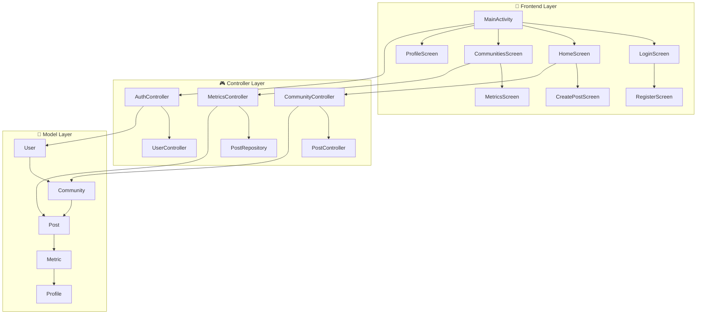

# Proyecto 5 - Plataforma de Comunidades Educativas

<div align="center">


### 🎓 Transformando la Educación a través de Comunidades Colaborativas

[](https://github.com/usuario/proyecto-5)
[](https://developer.android.com/about/versions/nougat)
[](LICENSE)
[]()

</div>

---

## 📋 Resumen Ejecutivo

**Proyecto 5** es una aplicación móvil Android innovadora que revoluciona el modelo educativo tradicional mediante la creación de una plataforma de comunidades colaborativas. La aplicación facilita el intercambio horizontal de conocimientos, promoviendo un entorno educativo inclusivo, motivador y centrado en el usuario.

### Visión
Transformar la educación de un modelo jerárquico y aislado a uno colectivo, significativo y accesible para todos los usuarios, especialmente jóvenes y estudiantes.

### Misión
Crear un ecosistema digital que reduzca el aislamiento educativo, fortalezca el sentido de pertenencia comunitaria y fomente la motivación intrínseca para el aprendizaje continuo.

---

## 📊 Información del Proyecto

<div align="center">

| 📋 Campo | 📝 Detalle |
|:---:|:---|
| **🏷️ Nombre** | Proyecto 5 |
| **📱 Plataforma** | Android (API 24+) |
| **🔧 Lenguaje** | Kotlin |
| **🏗️ Arquitectura** | MVC Pattern |
| **🎨 UI Framework** | Jetpack Compose |
| **📦 Versión** | 1.0 |

### 📈 Estadísticas del Proyecto

| Métrica | Valor |
|:---:|:---:|
| **📁 Archivos Kotlin** | 27 |
| **🎯 Pantallas** | 9 |
| **🎮 Controladores** | 6 |
| **💾 Modelos** | 5 |
| **📱 SDK Mínimo** | API 24 |
| **🎯 SDK Objetivo** | API 34 |

</div>

---

## Equipo de Desarrollo

| Rol | Nombre | Contribución |
|-----|--------|--------------|
| **Desarrollador Principal** | Vicente A. Elias Riveros | Arquitectura, ,UI/UX, Lógica de Negocio |
| **Desarrollador Principal** | Jean P. Valenzuela Navarrete | Frontend, UI/UX,Backend, Integración |

---

## 🏗️ Arquitectura del Sistema

<div align="center">



</div>

### Estructura Modular

```
com.example.evaluacion2/
├── 📁 model/                    # Capa de Datos
│   ├── User.kt                  # Entidad Usuario
│   ├── Community.kt            # Entidad Comunidad
│   ├── Post.kt                  # Entidad Publicación
│   ├── Metric.kt                # Métricas de Análisis
│   └── Profile.kt               # Perfil de Usuario
│
├── 📁 controller/               # Capa de Lógica de Negocio
│   ├── AuthController.kt        # Gestión de Autenticación
│   ├── UserController.kt        # Gestión de Usuarios
│   ├── CommunityController.kt   # Gestión de Comunidades
│   ├── PostController.kt        # Gestión de Publicaciones
│   ├── PostRepository.kt        # Repositorio de Datos
│   └── MetricsController.kt     # Análisis y Métricas
│
├── 📁 view/                     # Capa de Presentación
│   ├── MainActivity.kt          # Actividad Principal
│   ├── LoginScreen.kt           # Autenticación
│   ├── RegisterScreen.kt        # Registro de Usuario
│   ├── HomeScreen.kt            # Feed Principal
│   ├── CommunitiesScreen.kt     # Descubrimiento de Comunidades
│   ├── CreatePostScreen.kt      # Creación de Contenido
│   ├── MetricsListScreen.kt     # Panel de Métricas
│   ├── CommunityMetricsScreen.kt # Análisis Detallados
│   ├── ProfileScreen.kt         # Perfil de Usuario
│   ├── EditProfileScreen.kt     # Edición de Perfil
│   └── 📁 components/
│       └── BottomNavBar.kt      # Componente de Navegación
│
├── 📁 navigation/
│   └── NavGraph.kt              # Configuración de Navegación
│
└── 📁 ui/theme/                 # Sistema de Diseño
    ├── Color.kt                 # Paleta de Colores
    ├── Theme.kt                 # Configuración de Tema
    └── Type.kt                  # Tipografía
```

### Patrón Arquitectónico MVC

- **Modelo**: Entidades de datos y lógica de negocio
- **Vista**: Componentes de UI con Jetpack Compose
- **Controlador**: Gestión de estado y coordinación entre capas

---

## ✨ Funcionalidades Principales

<div align="center">

| 🔐 Autenticación | 🏠 Feed Dinámico | 👥 Comunidades | 📊 Métricas | 👤 Perfiles |
|:---:|:---:|:---:|:---:|:---:|
| **Multi-modal** | **Multimedia** | **Categorizadas** | **Tiempo Real** | **Integrales** |
| Login/Registro/Invitado | Texto/Imagen/Video | Destacadas/Cerca/Nuevas | 7/30/90 días | Personalización |

</div>

### 🔐 Sistema de Autenticación y Gestión de Usuarios

#### Características de Seguridad
- **Autenticación Multi-modal**: Email/contraseña y modo invitado
- **Validación de Datos**: Verificación de credenciales en tiempo real
- **Gestión de Sesiones**: Estado persistente y control de acceso
- **Modo Invitado**: Acceso limitado para usuarios no registrados

#### Flujo de Usuario
```
Registro → Validación → Creación de Perfil → Acceso Completo
    ↓
Inicio de Sesión → Autenticación → Dashboard Principal
    ↓
Modo Invitado → Acceso Limitado → Funcionalidades Básicas
```

### 🏠 Feed de Contenido Dinámico

#### Capacidades de Contenido
- **Publicaciones Multimodales**: Texto, imágenes y videos
- **Sistema de Encuestas**: Creación y participación en encuestas interactivas
- **Gestión de Eventos**: Anuncios y organización de eventos comunitarios
- **Interacciones Sociales**: Comentarios, votaciones y seguimiento de participación

#### Tipos de Contenido Soportados
- **Publicaciones Estándar**: Contenido textual con multimedia
- **Encuestas**: Preguntas con múltiples opciones y estadísticas en tiempo real
- **Eventos**: Anuncios de actividades con detalles y fechas

### 👥 Gestión Avanzada de Comunidades

#### Categorización Inteligente
- **Comunidades Destacadas**: Contenido curado y verificado
- **Comunidades por Ubicación**: Descubrimiento basado en proximidad geográfica
- **Comunidades del Usuario**: Gestión de membresías activas
- **Nuevas Comunidades**: Descubrimiento de comunidades emergentes

#### Estados de Comunidad
- **Abierta**: Acceso libre para todos los usuarios
- **Autogestionada**: Requiere aprobación de moderadores
- **Solicitar Acceso**: Proceso de solicitud controlado

#### Sistema de Roles
- **Moderador**: Gestión de contenido y miembros
- **Miembro**: Participación estándar en la comunidad
- **Coordinador**: Liderazgo y organización de actividades

### 📊 Sistema de Análisis y Métricas

#### Métricas de Comunidad
- **Miembros Activos**: Seguimiento de participación en tiempo real
- **Adquisición de Nuevos Miembros**: Análisis de crecimiento orgánico
- **Tasas de Participación**: Métricas de engagement y retención
- **Actividad de Encuestas**: Análisis de interacciones y respuestas

#### Reportes Temporales
- **Análisis de 7 días**: Tendencias semanales
- **Análisis de 30 días**: Métricas mensuales
- **Análisis de 90 días**: Tendencias trimestrales

#### Visualización de Datos
- **Gráficos Interactivos**: Representación visual de métricas
- **Paneles de Control**: Dashboards personalizables
- **Reportes Exportables**: Generación de informes detallados

### 👤 Gestión Integral de Perfiles

#### Características del Perfil
- **Información Personal**: Datos del usuario y preferencias
- **Estadísticas de Actividad**: Seguimiento de participación
- **Sistema de Logros**: Puntuación y reconocimientos
- **Historial de Interacciones**: Registro de actividades recientes

---

## Especificaciones Técnicas

### Stack Tecnológico

| Componente | Tecnología | Versión |
|------------|------------|---------|
| **Lenguaje** | Kotlin | 1.9.20 |
| **Framework UI** | Jetpack Compose | 2023.10.01 |
| **Sistema de Diseño** | Material Design 3 | Latest |
| **Navegación** | Navigation Compose | 2.7.5 |
| **Carga de Imágenes** | Coil | 2.5.0 |
| **Arquitectura** | MVC Pattern | - |
| **SDK Mínimo** | Android API 24 | Android 7.0 |
| **SDK Objetivo** | Android API 34 | Android 14 |

### Dependencias Principales

```kotlin
// Core Android
implementation("androidx.core:core-ktx:1.12.0")
implementation("androidx.lifecycle:lifecycle-runtime-ktx:2.6.2")
implementation("androidx.activity:activity-compose:1.8.1")

// Jetpack Compose BOM
implementation(platform("androidx.compose:compose-bom:2023.10.01"))
implementation("androidx.compose.ui:ui")
implementation("androidx.compose.material3:material3")

// Navigation
implementation("androidx.navigation:navigation-compose:2.7.5")

// Image Loading
implementation("io.coil-kt:coil-compose:2.5.0")

// Extended Icons
implementation("androidx.compose.material:material-icons-extended:1.5.4")

// ViewModel
implementation("androidx.lifecycle:lifecycle-viewmodel-compose:2.6.2")
```

### Configuración del Proyecto

#### Gradle Configuration
- **Android Gradle Plugin**: 8.1.4
- **Kotlin Compiler**: 1.5.4
- **Java Compatibility**: 1.8
- **Build Types**: Debug y Release
- **ProGuard**: Configurado para builds de producción

#### Estructura de Build
```
app/build/
├── generated/          # Archivos generados automáticamente
├── intermediates/      # Archivos intermedios del build
├── outputs/           # APKs y archivos de salida
└── tmp/               # Archivos temporales
```

---

## Experiencia de Usuario (UX/UI)

### Principios de Diseño

#### Material Design 3
- **Consistencia Visual**: Implementación completa de las directrices de Material Design
- **Accesibilidad**: Cumplimiento de estándares de accesibilidad WCAG
- **Responsive Design**: Adaptación automática a diferentes tamaños de pantalla
- **Dark/Light Theme**: Soporte para temas dinámicos del sistema

#### Sistema de Colores
```kotlin
// Paleta Principal
val Purple40 = Color(0xFF6650a4)      // Color primario
val PurpleGrey40 = Color(0xFF625b71)  // Color secundario
val Pink40 = Color(0xFF7D5260)        // Color terciario

// Paleta Oscura
val Purple80 = Color(0xFFD0BCFF)      // Primario oscuro
val PurpleGrey80 = Color(0xFFCCC2DC)  // Secundario oscuro
val Pink80 = Color(0xFFEFB8C8)        // Terciario oscuro
```

### Flujo de Navegación

<div align="center">


</div>

#### Componentes de Navegación
- **Bottom Navigation Bar**: Navegación principal entre secciones
- **Navigation Graph**: Gestión centralizada de rutas
- **Deep Linking**: Soporte para enlaces profundos
- **Back Stack Management**: Gestión inteligente del historial

---

## Gestión de Datos

### Implementación Actual

#### Datos Simulados (Mock Data)
La aplicación utiliza actualmente un sistema de datos simulados para propósitos de demostración y desarrollo:

- **Almacenamiento en Memoria**: Todos los datos se mantienen durante la sesión
- **Datos Predefinidos**: Conjuntos de datos de muestra para testing
- **Controladores Mock**: Implementación de lógica de negocio sin persistencia

#### Estructura de Datos Mock
```kotlin
// Ejemplo de datos simulados
val comunidadesMock = listOf(
    Community(
        id = "1",
        nombre = "Huerto Urbano Centro",
        descripcion = "Huerto comunitario en el centro",
        miembros = 1200,
        activosRecientes = 2,
        distancia = "2 km",
        estado = EstadoComunidad.ABIERTA,
        categoria = "Destacadas"
    ),
    // ... más comunidades
)
```

### Estrategia de Migración a Producción

#### Fase 1: Integración Backend
1. **API Integration**: Implementación de cliente HTTP (Retrofit/Ktor)
2. **Authentication**: Sistema de tokens JWT
3. **Error Handling**: Manejo robusto de errores de red
4. **Loading States**: Estados de carga y feedback visual

#### Fase 2: Persistencia Local
1. **Room Database**: Base de datos local para funcionalidad offline
2. **Data Synchronization**: Sincronización bidireccional
3. **Cache Management**: Estrategia de caché inteligente
4. **Conflict Resolution**: Resolución de conflictos de datos

#### Fase 3: Optimización
1. **Performance Monitoring**: Métricas de rendimiento
2. **Memory Management**: Optimización de uso de memoria
3. **Network Optimization**: Compresión y optimización de datos
4. **Analytics Integration**: Tracking de uso y comportamiento

---

## Estándares de Desarrollo

### Convenciones de Código

#### Kotlin Style Guide
- **Naming Conventions**: camelCase para variables, PascalCase para clases
- **Package Structure**: Organización por funcionalidad
- **Documentation**: KDoc para funciones públicas
- **Code Formatting**: Kotlin formatting rules

#### Jetpack Compose Best Practices
- **State Management**: Uso apropiado de State y ViewModel
- **Recomposition Optimization**: Minimización de recomposiciones innecesarias
- **Component Composition**: Creación de componentes reutilizables
- **Theme Integration**: Uso consistente del sistema de temas

### Estrategia de Testing

#### Testing Pyramid
```
    ┌─────────────────┐
    │   E2E Tests     │ ← Pruebas de extremo a extremo
    ├─────────────────┤
    │ Integration Tests│ ← Pruebas de integración
    ├─────────────────┤
    │   Unit Tests     │ ← Pruebas unitarias
    └─────────────────┘
```

#### Tipos de Pruebas
- **Unit Tests**: Validación de lógica de negocio en controladores
- **UI Tests**: Pruebas de componentes Compose
- **Integration Tests**: Validación de flujos completos
- **Performance Tests**: Pruebas de rendimiento y memoria

#### Herramientas de Testing
```kotlin
// Dependencias de Testing
testImplementation("junit:junit:4.13.2")
androidTestImplementation("androidx.test.ext:junit:1.1.5")
androidTestImplementation("androidx.test.espresso:espresso-core:3.5.1")
androidTestImplementation("androidx.compose.ui:ui-test-junit4")
```

---

## Proceso de Despliegue

### Configuración de Build

#### Build Variants
- **Debug**: Desarrollo y testing
  - Minificación deshabilitada
  - Logging habilitado
  - Signing con debug keystore
- **Release**: Producción
  - Minificación habilitada
  - ProGuard/R8 optimización
  - Signing con release keystore

#### Versionado
- **Version Code**: 1 (incremental para cada release)
- **Version Name**: "1.0" (semantic versioning)
- **Target SDK**: 34 (Android 14)
- **Min SDK**: 24 (Android 7.0)

### Distribución

#### Canales de Distribución
1. **Internal Testing**: Distribución interna para testing
2. **Closed Testing**: Beta testing con usuarios seleccionados
3. **Open Testing**: Beta pública
4. **Production**: Release público en Google Play Store

#### Requisitos de Distribución
- **Google Play Console**: Configuración de cuenta de desarrollador
- **App Signing**: Certificado de firma de aplicación
- **Store Listing**: Descripción, capturas de pantalla, iconos
- **Content Rating**: Clasificación de contenido apropiada

---

## Roadmap y Futuras Mejoras

### Versión 1.1 (Próxima Release)
- [ ] Integración con backend real
- [ ] Sistema de notificaciones push
- [ ] Funcionalidad offline mejorada
- [ ] Análisis de uso y métricas avanzadas

### Versión 1.2 (Futuro)
- [ ] Chat en tiempo real
- [ ] Sistema de badges y gamificación
- [ ] Integración con redes sociales
- [ ] Modo multilingüe

### Versión 2.0 (Visión a Largo Plazo)
- [ ] Versión iOS (React Native/Flutter)
- [ ] Web application
- [ ] API pública para desarrolladores
- [ ] Integración con sistemas educativos existentes

---

## Soporte y Contacto

### Documentación Adicional
- **API Documentation**: [Enlace a documentación de API]
- **Design System**: [Enlace a guía de diseño]
- **Contributing Guide**: [Enlace a guía de contribución]

### Contacto del Equipo
- **Desarrollo**: [Equipo5@Proyecto5.com]
- **Soporte Técnico**: [Poporte5@Proyecto5.com]
- **Producto**: [Producto5@Producto5.com]

### Licencia
Este proyecto está bajo la licencia **MIT License**. Ver el archivo [`LICENSE`](LICENSE) para más detalles.

---

## Changelog

### Versión 1.0 (Release Inicial)
- ✅ Sistema de autenticación completo
- ✅ Feed de contenido dinámico
- ✅ Gestión de comunidades
- ✅ Sistema de métricas y análisis
- ✅ Perfiles de usuario
- ✅ Navegación intuitiva
- ✅ Diseño Material 3
- ✅ Soporte para Android 7.0+

---

*Última actualización: [23-10-2025]*
*Versión del documento: 1.0.1*